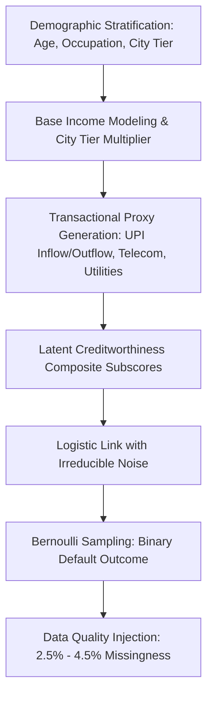

# Data Card: CreditBridge Alternative Credit Dataset (Synthetic V2)

## 1. Dataset Overview

| Attribute | Specification |
| :--- | :--- |
| **Dataset Name** | CreditBridge Alternative Credit Dataset |
| **Version** | 2.0.0 (Synthetic Baseline) |
| **Release Date** | September 2026 |
| **Record Count** | 8,000 synthetic borrower profiles |
| **Feature Count** | 22 columns (1 identifier, 3 demographic/self-reported, 17 behavioral proxies, 1 binary target) |
| **Data Modality** | Tabular (Continuous, Discrete, and Low-Cardinality Categorical) |
| **Target Variable** | `defaulted` (Binary: 0 = Fully Repaid, 1 = Default / 90+ DPD Proxy) |
| **Primary File** | `data/synthetic_borrowers.csv` (1,193,374 bytes) |
| **Generator Script** | `data/generate_synthetic_data.py` (Random Seed = 42) |
| **Distribution Schema** | `data/reference_distributions.json` |

---

## 2. Dataset Purpose & Intended Domain

CreditBridge addresses the persistent credit gap in India's informal and gig economy, where an estimated 150+ million individuals lack formal credit bureau coverage (CIBIL/Experian score = -1 or "thin file"). 

Traditional credit underwriting relies on documented pay stubs, income tax returns (ITR), and past loan repayment histories. Independent gig workers (e.g., quick-commerce delivery, rideshare drivers) and informal micro-entrepreneurs (kirana operators, street vendors) transact predominantly via UPI and cash, rendering them invisible to legacy scoring models.

### Explicit Disclosure & Core Truth
> [!IMPORTANT]
> **This dataset is 100% synthetically generated.** No real borrower PII or real banking transactions were used in its synthesis. While statistical distributions and behavioral correlations were engineered to reflect published Indian micro-finance and fintech industry patterns, this dataset serves solely for academic exploration, algorithm prototyping, and pipeline validation. It cannot establish empirical credit performance or capital adequacy for commercial lending.

---

## 3. Data Generation Architecture

The dataset was generated using `data/generate_synthetic_data.py` with fixed pseudo-random generator seeds (`numpy.random.seed(42)`, `Faker.seed(42)`).

### 3.1 Demographic Stratification & Marginal Distributions
- **Age**: Sampled from $\mathcal{N}(32.0, 7.5^2)$, clipped to $[18, 60]$. Mean: 32.1 years; Median: 32.0 years.
- **Occupation Types**: Partitioned across six informal/gig economic archetypes:
  - `gig_delivery` (25%): Quick-commerce and food delivery partners (Zepto, Blinkit, Zomato, Swiggy).
  - `gig_rideshare` (20%): Two-wheeler and four-wheeler drivers (Uber, Ola, Rapido).
  - `informal_retail` (15%): Kirana shop assistants, bazaar trade workers.
  - `small_trader` (15%): Micro-merchants, street cart vendors.
  - `daily_wage_labor` (15%): Casual construction and warehouse laborers.
  - `freelance_digital` (10%): Remote digital micro-contractors, freelance designers.
- **City Tier**:
  - `tier_1` (40%): Metro cities (Bengaluru, Mumbai, Delhi-NCR, Hyderabad). Income multiplier = $1.25$.
  - `tier_2` (35%): Emerging urban centers (Pune, Jaipur, Ahmedabad, Lucknow). Income multiplier = $1.00$.
  - `tier_3` (25%): Semi-urban and rural centers. Income multiplier = $0.80$.

### 3.2 Income & Cash Flow Generation
Base income is conditioned on occupation and scaled by city tier multiplier:
- Daily wage labor: $\mathcal{U}(10000, 17000)$ INR
- Small trader: $\mathcal{U}(14000, 32000)$ INR
- Gig delivery / rideshare: $\mathcal{U}(16000, 36000)$ INR
- Informal retail: $\mathcal{U}(12000, 24000)$ INR
- Freelance digital: $\mathcal{U}(18000, 50000)$ INR

UPI inflows track income with additive liquidity noise. UPI outflows are modeled via an outflow ratio conditioned on income:
$$\text{outflow\_ratio} = \text{clip}\left(0.92 - 0.12 \times \text{norm\_income} + \mathcal{N}(0, 0.04^2), 0.60, 1.08\right)$$
Higher-income borrowers maintain higher savings buffers, while lower-income borrowers experience tighter liquidity margins.

### 3.3 Behavioral Proxy Modeling
1. **Utility Payments**: 
   - `electricity_bill_ontime_rate`: Modeled via Beta distribution with positive income correlation, reflecting bill settlement discipline ($[0.10, 1.00]$).
   - `electricity_bill_avg_delay_days`: Inversely correlated with on-time rate ($[0.0, 45.0]$ days).
2. **Telecom Recharges**:
   - `recharge_frequency_per_month`: Centered around 1.0 to 3.5 recharges/month.
   - `avg_recharge_amount`: Ticket size ranging from 149 to 719 INR.
   - `recharge_amount_volatility`: Coefficient of variation capturing erratic top-up behavior ($[0.05, 0.85]$).
   - `days_since_last_recharge_lapse`: Days since service disruption ($[0, 365]$ days).
3. **Cash Flow Lumpiness & Informal Debt**:
   - `upi_inflow_volatility_coefficient`: Modeled via Gamma distributions per occupation ($\Gamma(3.5, 0.14)$ for daily wage/freelancers vs $\Gamma(2.0, 0.10)$ for retail traders).
   - `p2p_vs_merchant_txn_ratio`: Log-normally distributed ($\mu=-0.2, \sigma=0.6$, clipped to $[0.05, 5.0]$). High P2P indicates informal peer borrowing or distress borrowing.
4. **Gig Platform Engagement**:
   - Filtered exclusively for `gig_delivery` and `gig_rideshare` (null for others).
   - `avg_weekly_gig_hours`: $\mathcal{N}(42.0, 10.0^2)$ clipped to $[10, 75]$.
   - `gig_platform_rating`: Skewed toward $4.2 - 4.95$ via exponential offset ($5.0 - \text{Exp}(0.25)$).
   - `active_weeks_last_6_months`: Binomial draw $B(26, 0.82)$.

---

## 4. Target Variable Calibration

The target `defaulted` is a binary outcome ($1 = \text{default}, 0 = \text{repaid}$) generated via a structural latent creditworthiness framework.

### 4.1 Latent Creditworthiness Formulation
Latent creditworthiness $L \in [0, 1]$ is a convex combination of four normalized subscores:
$$L = 0.40 \cdot S_{\text{income}} + 0.30 \cdot S_{\text{payment}} + 0.20 \cdot S_{\text{volatility}} + 0.10 \cdot S_{\text{footprint}}$$

1. **Income Stability Subscore ($40\%$)**:
   $$S_{\text{income}} = 0.60 \cdot \text{clip}\left(\frac{\text{net\_margin}}{0.35}, 0, 1\right) + 0.40 \cdot \left(1 - \text{clip}\left(\frac{\text{upi\_volatility}}{0.85}, 0, 1\right)\right)$$
2. **Payment Consistency Subscore ($30\%$)**:
   $$S_{\text{payment}} = 0.40 \cdot \text{ontime\_rate} + 0.25 \cdot \left(1 - \frac{\text{delay\_days}}{30}\right) + 0.20 \cdot \frac{\text{lapse\_days}}{180} + 0.15 \cdot \text{gig\_bonus}$$
3. **Earnings Volatility Subscore ($20\%$)**:
   $$S_{\text{volatility}} = 0.60 \cdot \left(1 - \frac{\text{recharge\_cv}}{0.70}\right) + 0.40 \cdot \left(1 - \frac{\text{p2p\_ratio} - 0.2}{2.5}\right)$$
4. **Digital Footprint Subscore ($10\%$)**:
   $$S_{\text{footprint}} = 0.60 \cdot \frac{\text{sim\_tenure}}{72} + 0.40 \cdot \frac{\text{app\_tenure}}{36}$$

### 4.2 Link Function & Outcome Sampling
Default log-odds are modeled with structural intercept $\beta_0$, sensitivity $\beta_1$, and stochastic shock $\epsilon$:
$$\log\left(\frac{P(\text{default})}{1 - P(\text{default})}\right) = 1.45 - 6.20 \cdot L + \epsilon, \quad \epsilon \sim \mathcal{N}(0, 0.75^2)$$
$$P(\text{default}) = \frac{1}{1 + e^{-\text{log\_odds}}}$$
$$\text{defaulted}_i \sim \text{Bernoulli}(P(\text{default})_i)$$

**Empirical Result**: Yields an overall default rate of **14.1%** (1,128 defaults across 8,000 borrowers), aligning with typical bad rates observed in Indian unsecured micro-lending portfolios.

---

## 5. Injected Missingness & Data Quality

To simulate real-world data collection imperfections (e.g., cash-only transactions, unlinked utility accounts), controlled missingness was injected into the synthetic records:

| Column | Missing Rate | Real-World Justification |
| :--- | :--- | :--- |
| `monthly_upi_transaction_count` | 4.0% | Borrowers transacting primarily in physical cash |
| `monthly_upi_inflow_avg` | 3.5% | Statement parsing failure or missing statement page |
| `monthly_upi_outflow_avg` | 3.5% | Missing withdrawal ledgers |
| `upi_inflow_volatility_coefficient` | 4.5% | Insufficient observation window (< 2 monthly cycles) |
| `days_since_last_recharge_lapse` | 3.0% | Postpaid corporate/family plan (individual billing absent) |
| `electricity_bill_avg_delay_days` | 2.5% | Tenant without direct electricity meter connection |
| `avg_weekly_gig_hours` | 55.0% | Non-gig workers (informal retail, traders, daily wage) |
| `gig_platform_rating` | 55.0% | Non-gig workers |
| `active_weeks_last_6_months` | 55.0% | Non-gig workers |
| `earnings_coefficient_of_variation` | 55.0% | Non-gig workers |

---

## 6. Synthetic Distribution Artifacts & Known Limitations

1. **Absence of Macroeconomic Shocks**:
   The generator assumes stationary economic conditions. It does not encode systemic shocks such as pandemic lockdowns, monsoons, fuel price spikes, or regulatory changes in UPI transaction limits.
2. **Smooth Distribution Fallacy**:
   Real-world bank statement data contains extreme kurtosis, fat tails, and multimodal clusters (e.g., zero-balance days, sudden overdrafts) that smooth Gaussian and Gamma distributions under-represent.
3. **No Fraud or Adversarial Gaming**:
   The synthetic dataset does not contain synthetic round-tripping, circular UPI loops, or falsified transaction descriptions designed to trick heuristic classifiers.
4. **Conditional Independence Oversimplification**:
   While primary correlations were explicitly designed, cross-correlations (such as telecom recharge ticket size directly varying with seasonal gig hours) are simplified relative to actual borrower behavior.
5. **No Direct Ground Truth for Real Bank Statements**:
   Because real bank statement uploads undergo heuristic parsing (`real_data_parser.py`) and feature extraction (`real_data_features.py`), their distribution may diverge from the clean mathematical distributions of this synthetic table. Reference distributions (`data/reference_distributions.json`) are employed during inference to detect such shifts.
