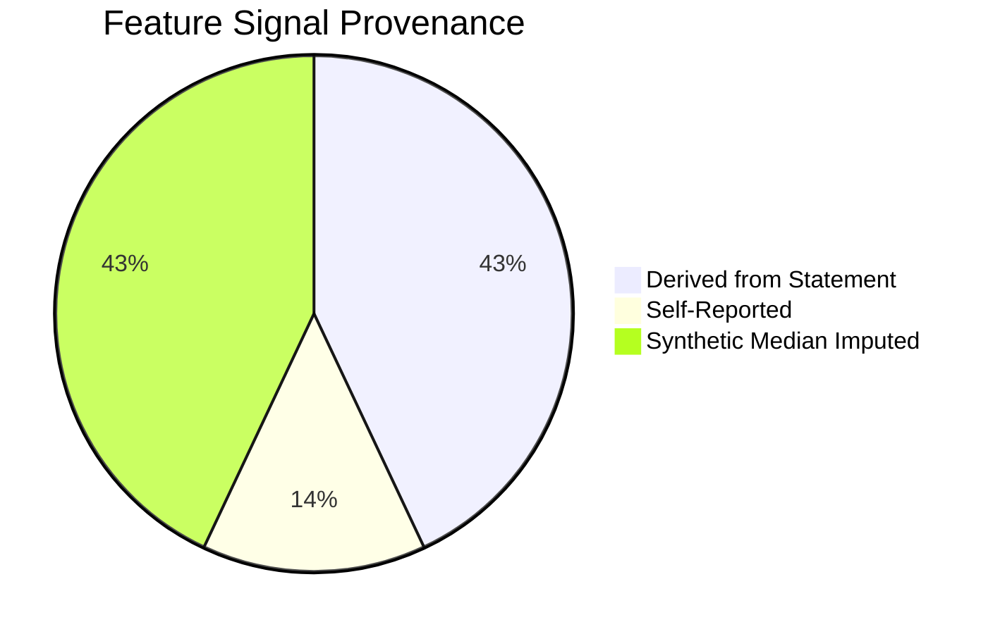

# Feature Lineage & Provenance Specification

## 1. Overview & Regulatory Rationale

Alternative credit scoring systems evaluated by prudential banking regulators (e.g., Reserve Bank of India, US Federal Reserve SR 11-7, Basel Committee on Banking Supervision) require absolute traceability of input signals. Lenders must prove:
1. **Provenance**: Where every feature originated (statement transaction, user declaration, or mathematical derivation).
2. **Deterministic Transformation**: How raw transactional tokens were aggregated into model-ready numbers.
3. **Imputation Boundary**: Which features could not be observed and how they were handled without data leakage.
4. **Proxy Validity & Failure Modes**: The operational assumptions and economic limitations of each proxy.

CreditBridge enforces strict provenance tracking via `src/feature_provenance.py` and `src/real_data_contracts.py`. Every inference request produces a machine-readable `FeatureProvenanceRecord` for all 21 model predictor features.

---

## 2. Complete 21-Feature Lineage Matrix

| # | Feature Name | Provenance State | Raw Source Signal | Mathematical Formulation / Logic | Imputation Strategy | Operational Limitation & Proxy Caveat |
| :--- | :--- | :--- | :--- | :--- | :--- | :--- |
| **1** | `monthly_income_estimate` | **DERIVED** | Monthly statement credit entries | Sum of salary/gig inflows annualized; fallback to non-transfer total credits divided by active months. | Fallback to total credits if salary tags absent. | Irregular cash deposits may be missed; cannot verify income sustainability. |
| **2** | `monthly_upi_transaction_count` | **DERIVED** | Total count of UPI debits & credits | Total transactions with UPI channel identifier divided by observation period in months ($T / M$). | Zero if no UPI tags present. | High transaction frequency may reflect pass-through micro-payments rather than economic health. |
| **3** | `monthly_upi_inflow_avg` | **DERIVED** | Inflow credits via UPI channel | Total UPI credit volume divided by active calendar months ($V_{\text{in}} / M$). | Zero if no UPI credits. | Vulnerable to peer borrowing and account pass-through. |
| **4** | `monthly_upi_outflow_avg` | **DERIVED** | Outflow debits via UPI channel | Total UPI debit volume divided by active calendar months ($V_{\text{out}} / M$). | Zero if no UPI debits. | Does not capture cash withdrawals spent outside digital rails. |
| **5** | `upi_inflow_volatility_coefficient`| **DERIVED** | Monthly aggregated UPI credits | Ratio of sample standard deviation to mean of monthly inflow totals: $\sigma_{\text{in}} / \mu_{\text{in}}$. | Set to median (0.35) if months < 2. | Short observation windows (<6 months) yield noisy, unstable volatility estimates. |
| **6** | `p2p_vs_merchant_txn_ratio` | **DERIVED** | Transaction counterparty & VPA handles | Ratio of P2P transfer volume to P2M merchant payment volume: $V_{\text{P2P}} / \max(V_{\text{P2M}}, 1.0)$. | Defaults to 1.0 if both are zero. | Heuristic keyword tagging may misclassify personal QR transfers as merchant spend. |
| **7** | `recharge_frequency_per_month` | **DERIVED** | Utility/telecom debit transactions | Total telecom/utility recharge transactions divided by observation period ($N_{\text{rec}} / M$). | Zero if no recharge entries found. | Borrowers on annual recharge plans appear as zero monthly frequency. |
| **8** | `avg_recharge_amount` | **DERIVED** | Utility/telecom debit ticket amounts | Arithmetic mean of telecom recharge debit amounts: $\sum A_{\text{rec}} / N_{\text{rec}}$. | Median fallback (299.0 INR) if $N_{\text{rec}} = 0$. | Family top-ups or multiple SIM recharges distort individual usage proxy. |
| **9** | `recharge_amount_volatility` | **DERIVED** | Utility/telecom debit ticket amounts | Coefficient of variation of recharge ticket amounts: $\sigma_{\text{rec}} / \mu_{\text{rec}}$. | Set to zero if $N_{\text{rec}} \le 1$. | Frequent plan changes due to promotions create artificial volatility. |
| **10** | `age` | **SELF_REPORTED** | Applicant registration form | Integer age in years validated against range $[18, 60]$. | Mandatory form field; rejects missing. | Self-reported; requires digital KYC / Aadhaar verification in production. |
| **11** | `occupation_type` | **SELF_REPORTED** | Applicant registration form | Categorical string from allowed enum (`gig_delivery`, `gig_rideshare`, etc.). | Mandatory form field; rejects missing. | Self-reported; platform API verification required in production. |
| **12** | `city_tier` | **SELF_REPORTED** | Applicant registration form / PIN code | Categorical string from allowed enum (`tier_1`, `tier_2`, `tier_3`). | Mandatory form field; rejects missing. | Living cost proxy; coarse geographic granularity. |
| **13** | `electricity_bill_ontime_rate` | **UNAVAILABLE / IMPUTED** | Utility provider API (absent in statement) | Preserved as `NaN` during extraction; imputed via pipeline `SimpleImputer(strategy='median')`. | Median (0.85) from synthetic baseline. | Bank statement narration rarely contains due dates or on-time flags. |
| **14** | `electricity_bill_avg_delay_days` | **UNAVAILABLE / IMPUTED** | Utility provider API (absent in statement) | Preserved as `NaN` during extraction; imputed via pipeline `SimpleImputer(strategy='median')`. | Median (3.2 days) from synthetic baseline. | Requires direct integration with state electricity boards (BBPS). |
| **15** | `days_since_last_recharge_lapse` | **UNAVAILABLE / IMPUTED** | Telecom operator API (absent in statement) | Preserved as `NaN` during extraction; imputed via pipeline `SimpleImputer(strategy='median')`. | Median (142.0 days) from synthetic baseline. | Bank statement shows payment timestamp, not service disconnection date. |
| **16** | `avg_weekly_gig_hours` | **UNAVAILABLE / IMPUTED** | Gig platform telemetry (absent in statement) | Preserved as `NaN` during extraction; imputed via pipeline `SimpleImputer(strategy='median')`. | Median (42.0 hrs) for gig workers; NaN for non-gig. | Requires OAuth integration with platform aggregators (Zomato, Swiggy, Uber). |
| **17** | `gig_platform_rating` | **UNAVAILABLE / IMPUTED** | Gig platform telemetry (absent in statement) | Preserved as `NaN` during extraction; imputed via pipeline `SimpleImputer(strategy='median')`. | Median (4.72) for gig workers; NaN for non-gig. | Ratings suffer from survivorship bias (platforms purge drivers below 4.3). |
| **18** | `active_weeks_last_6_months` | **UNAVAILABLE / IMPUTED** | Gig platform telemetry (absent in statement) | Preserved as `NaN` during extraction; imputed via pipeline `SimpleImputer(strategy='median')`. | Median (22.0 weeks) for gig workers. | Weekly gig platform logins cannot be inferred from monthly bank statements. |
| **19** | `earnings_coefficient_of_variation`| **UNAVAILABLE / IMPUTED** | Gig platform telemetry (absent in statement) | Preserved as `NaN` during extraction; imputed via pipeline `SimpleImputer(strategy='median')`. | Median (0.31) for gig workers. | Weekly gig earnings CV differs from monthly bank deposit CV. |
| **20** | `phone_number_tenure_months` | **UNAVAILABLE / IMPUTED** | Telecom operator HLR (absent in statement) | Preserved as `NaN` during extraction; imputed via pipeline `SimpleImputer(strategy='median')`. | Median (36.0 months) from synthetic baseline. | Anti-fraud SIM tenure requires telco carrier verification. |
| **21** | `app_account_age_months` | **UNAVAILABLE / IMPUTED** | Fintech host platform metadata | Preserved as `NaN` during extraction; imputed via pipeline `SimpleImputer(strategy='median')`. | Median (14.0 months) from synthetic baseline. | Available to host app, but excluded from raw bank statement uploads. |

---

## 3. Signal Provenance Breakdown

Across the 21 predictor features required by the frozen model pipeline:
- **Directly Derived from Statement Data (9 features / 42.9%)**: Cash flow, UPI liquidity, P2P ratios, and recharge ticket sizes extracted directly from bank statement ledgers.
- **Self-Reported by Applicant (3 features / 14.3%)**: Age, occupation type, and city tier collected via application form inputs.
- **Unavailable from Bank Statements & Imputed via Synthetic Median (9 features / 42.9%)**: Utility payment timeliness, telecom lapse dates, gig platform telemetry, and digital tenure signals.

---

## 4. Downstream Pipeline Transformation & Encoding

Once raw and derived features are structured into a 21-column pandas DataFrame, they are passed to the frozen scikit-learn `FeaturePipeline` (`src/feature_engineering.py`):

1. **Numerical Preprocessing**:
   - 19 numerical features undergo `SimpleImputer(strategy='median')` followed by `StandardScaler()`.
   - The median statistics and scaling parameters $(\mu, \sigma)$ were fitted exclusively on the 8,000 synthetic training records during model training and are frozen inside `models/credit_model.pkl`.
2. **Categorical Preprocessing**:
   - `occupation_type` (6 categories) and `city_tier` (3 categories) are processed through `SimpleImputer(strategy='most_frequent')` followed by `OneHotEncoder(handle_unknown='ignore', drop='first')`.
   - Produces $5 + 2 = 7$ binary indicator variables.
3. **Total Dimensionality**:
   - Transformed design matrix contains **26 numerical/one-hot features** fed into the logistic regression estimator.

---

## 5. Why Imputation is Safer Than Uncalibrated User Input

In early prototype evaluations, allowing users to manually guess or input their utility delay days, telecom lapse dates, or gig hours introduced massive adverse selection:
- Applicants universally claimed 100% on-time utility payments, 0 delay days, and 5.0 platform ratings.
- Self-reported behavioral estimates lacked verification rails, leading to uncalibrated risk scores.
- By explicitly treating these 9 features as **UNAVAILABLE** and imputing them with the population median from the baseline synthetic distribution:
  1. The model evaluates applicants strictly on the variance of their **observed 9 statement-derived features** and declared demographics.
  2. The unobserved features act as neutral baseline constants, avoiding arbitrary scoring swings.
  3. Provenance tracking flags every imputed feature in the audit manifest, signaling to underwriters that high-confidence decisions require Account Aggregator integration.
