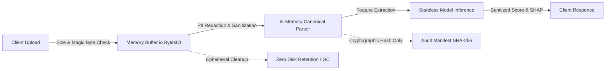

# Privacy, Security & Responsible AI Architecture

## 1. Threat Model & Security Philosophy

Alternative credit scoring systems process highly sensitive financial records, exposing lenders and fintech operators to significant regulatory, legal, and reputational risk. In India, digital credit assessments are governed strictly by the **Reserve Bank of India (RBI) Digital Lending Guidelines (2022/2023)** and the **Digital Personal Data Protection (DPDP) Act, 2023**.

CreditBridge operates under a **Zero-Trust, Zero-Retention, Air-Gapped** architectural philosophy. The system assumes:
1. Uploaded statement files may be hostile (e.g., binary masquerading, zip bombs, formula injection, path traversal).
2. Direct disk writes of customer financial transactions create unmanaged data liability and violate DPDP data minimization principles.
3. System errors must never leak internal infrastructure paths, credentials, or customer PII in logs or HTTP responses.
4. Inference execution must be strictly isolated from external networks to prevent data exfiltration.



---

## 2. Ingestion Defense & Upload Controls

Implemented in `src/privacy_security.py` via `validate_upload_security()`:

### 2.1 File Size & Processing Limits
- **10 MB Hard File Limit (`MAX_FILE_SIZE_BYTES = 10,485,760 bytes`)**: Protects the memory subsystem from Denial-of-Service (DoS) attacks via oversized payloads.
- **50,000 Row Processing Ceiling (`MAX_CSV_ROWS = 50,000`)**: Bounds CPU and memory consumption during parsing. Any file exceeding 50,000 lines is rejected before parsing.

### 2.2 Magic Byte & Executable Signature Verification
Attackers frequently disguise binary executables, shell scripts, or archives with `.csv` extensions. CreditBridge inspects the initial byte header against known dangerous signatures:
- `b"MZ"`: Windows PE executables and DLLs.
- `b"\x7fELF"`: Linux binary executables.
- `b"\xca\xfe\xba\xbe"`: Java bytecode and Mach-O binaries.
- `b"PK\x03\x04"`: ZIP archives, jar packages, and macro-enabled Office XML files.
- `b"%PDF"`: Binary PDF documents masquerading as CSV files.
- `b"#!"`: Unix shell scripts and cron payloads.

### 2.3 Path Traversal & Injection Prevention
- Filenames and paths are inspected for null-byte injections (`\x00`).
- Traversal sequences (`../`, `..\\`) and unauthorized absolute path access are intercepted with `PathTraversalError`.
- File extensions are restricted to an explicit whitelist: `{".csv", ".txt"}`.

### 2.4 Credential & Secret Detection
If incoming statements or form inputs contain sensitive credential tokens (`password`, `pin`, `mpin`, `upi_pin`, `otp`, `cvv`, `api_key`), the request is immediately aborted with `SecurityViolationError`.

---

## 3. Zero Disk Persistence & Ephemeral In-Memory Execution

Traditional data processing pipelines write temporary files to `/tmp` or local cache directories. In shared-tenant cloud environments or serverless containers, unencrypted temporary files create serious residual data exposure.

CreditBridge enforces **strictly in-memory processing**:
1. **Memory-Only Streams**: Statements are received and parsed exclusively through `io.BytesIO` or `io.StringIO` buffers.
2. **No File System Writes**: At no point in the parsing, feature extraction, scoring, or explainability pipeline is raw transaction data written to physical disk.
3. **Deterministic Garbage Collection**: Context managers (`EphemeralProcessingContext`) explicitly dereference large data structures and invoke garbage collection immediately after the assessment completes.
4. **Audit Verification**: Test suite `tests/test_privacy_security.py` asserts that zero temporary files are created on disk across the entire scoring lifecycle.

---

## 4. PII Redaction & Error Message Sanitization

### 4.1 PII Masking Patterns
Before any log generation, telemetry aggregation, or audit manifest creation, sensitive customer identifiers are masked using regex tokenizers:
- **Bank Account / Card Numbers**: 9-to-18 digit account sequences are masked to retain only the last 4 digits (`XXXX-XXXX-1234`).
- **Permanent Account Number (PAN)**: 10-character Indian PAN patterns (`[A-Z]{5}[0-9]{4}[A-Z]{1}`) are masked as `[REDACTED_PAN]`.
- **Mobile Phone Numbers**: 10-digit Indian phone numbers are masked as `[REDACTED_PHONE]`.
- **Email Addresses**: Normalized email addresses are masked as `[REDACTED_EMAIL]`.

### 4.2 Error Sanitization
Unhandled Python exceptions frequently leak internal system architecture:
```text
# UNSANITIZED LEAK EXAMPLE:
FileNotFoundError: [Errno 2] No such file in C:\Users\Admin\Production\creditbridge\models\weights.bin
```
CreditBridge passes all user-facing exceptions through `sanitize_error_message()`:
1. Strips local and server filesystem paths (`/home/...`, `C:\...`).
2. Redacts all embedded PII, account numbers, and email patterns.
3. Maps raw internal errors to clean, descriptive domain messages (e.g., `DateParsingError`, `FileValidationError`).
4. Prevents information leakage regarding internal model parameters or backend directories.

---

## 5. Air-Gapped Local Isolation

In compliance with DPDP Act data localization and cross-border transfer restrictions:
- **Zero Outbound Telemetry**: CreditBridge makes zero external HTTP, HTTPS, or socket calls during parsing, inference, or scoring.
- **Self-Contained Dependency Graph**: Model weights, imputation statistics, and reference distributions are bundled locally (`models/credit_model.pkl`, `data/reference_distributions.json`).
- **Verified via Unit Tests**: `test_network_isolation` in `tests/test_privacy_security.py` intercepts and asserts that zero socket or HTTP connections occur during statement processing.

---

## 6. Cryptographic Audit Manifest & Non-Repudiation

To satisfy regulatory model auditability without retaining customer financial records:
1. When a statement is processed, CreditBridge computes a cryptographic **SHA-256 fingerprint** of the raw input bytes.
2. The fingerprint is coupled with:
   - Inference timestamp (UTC ISO-8601).
   - Anonymized borrower identifier.
   - Evidence coverage ratio and data quality warnings.
   - Complete feature provenance records.
   - Calibrated score and risk tier.
3. The resulting `AuditManifest` provides complete non-repudiation: underwriters can mathematically verify whether a specific statement produced a specific score, while the underlying raw transactions are purged from memory.
