# Production Readiness Roadmap: 12 Pillars to Commercial Lending

## 1. Executive Summary

CreditBridge V2 has successfully demonstrated a hardened, privacy-preserving, and mathematically calibrated alternative credit evaluation backend for gig-economy and thin-file borrowers. 

However, transitioning from this **validated architectural prototype** to a **commercial, regulated underwriting engine** operating within a licensed Indian Bank or Non-Banking Financial Company (NBFC) requires addressing systemic data, infrastructure, governance, and regulatory requirements.

This roadmap outlines the **12 essential production pillars** required for enterprise deployment.

```mermaid
graph TD
    A[Phase 1: Data & Ground Truth] --> B[Pillar 1: Empirical Repayment Outcomes]
    A --> C[Pillar 2: RBI Account Aggregator Integration]
    A --> D[Pillar 3: NLP & Merchant VPA Graph]
    
    E[Phase 2: Platform & Features] --> F[Pillar 4: Enterprise Feature Store]
    E --> G[Pillar 5: Model Risk Management SR 11-7]
    E --> H[Pillar 6: Algorithmic Fairness & Parity]
    
    I[Phase 3: Operations & Monitoring] --> J[Pillar 7: Real-Time Drift & PSI Monitoring]
    I --> K[Pillar 8: Segmented Prior Calibration]
    I --> L[Pillar 9: Anti-Fraud & Graph Sybil Detection]
    
    M[Phase 4: Security & MLOps] --> N[Pillar 10: RBI & DPDP Compliance]
    M --> O[Pillar 11: Zero-Trust HSM Security]
    M --> P[Pillar 12: Champion-Challenger CI/CD]
```

---

## 2. The 12 Pillars of Production Readiness

### Pillar 1: Empirical Repayment Outcomes & Bureau Ground Truth
- **Current State**: Model trained on 8,000 synthetic borrower profiles with a simulated logistic target.
- **Production Requirement**:
  - Ingest a minimum of **50,000 to 100,000 historical unsecured micro-loan records** (ticket sizes ₹5,000–₹50,000) from an active NBFC portfolio.
  - Define ground-truth default using Basel standards: **90+ Days Past Due (DPD)** within an observed 12-month performance window.
  - Formulate vintage analysis curves and roll-rate matrices to calibrate default probabilities against actual portfolio loss rates.

### Pillar 2: RBI Account Aggregator (AA) Ecosystem Integration
- **Current State**: Users manually upload bank statement CSV files, introducing format variability, missing pages, and tampering risks.
- **Production Requirement**:
  - Register as a **Financial Information User (FIU)** licensed by the Reserve Bank of India (RBI).
  - Connect with regulated **Account Aggregators** (e.g., Setu, Onemoney, Anumati) via standardized REST/XML APIs.
  - Fetch digitally signed, tamper-proof financial transaction payloads directly from Financial Information Providers (FIPs / banks) with explicit, time-bound customer consent.

### Pillar 3: Advanced Transaction Classification (NLP & VPA Graph)
- **Current State**: Deterministic regex matching across standard Indian bank statement tokens.
- **Production Requirement**:
  - Deploy a domain-fine-tuned NLP classifier (e.g., **FinBERT-India**) trained on over 5 million anonymized UPI transaction strings.
  - Maintain an enterprise **Merchant VPA Knowledge Graph** mapping over 100,000 commercial entities, aggregators, and fintech handles to their exact Merchant Category Codes (MCC).
  - Provide confidence-weighted feature aggregations that scale according to semantic classification certainty.

### Pillar 4: Production Feature Store & Streaming Parity
- **Current State**: In-memory Python feature calculation via pandas on uploaded CSV statements.
- **Production Requirement**:
  - Implement an enterprise Feature Store (**Feast** or **Hopsworks**) maintaining strict parity between online streaming inference and offline batch training.
  - Implement point-in-time correctness to eliminate time-travel data leakage during model retraining.
  - Cache reusable behavioral features (e.g., telecom top-up patterns, 30-day liquidity averages) with microsecond lookup latencies.

### Pillar 5: Model Risk Management (MRM) & Model Governance Framework
- **Current State**: Model card and hostile defense documentation compiled for engineering handoff.
- **Production Requirement**:
  - Formalize compliance under **Federal Reserve SR 11-7 / OCC 2011-12** and **RBI Model Risk Guidelines**.
  - Establish an independent **Model Validation Group (MVG)** completely segregated from the model development team to perform annual code audits, sensitivity stress-testing, and conceptual soundness evaluations.
  - Maintain an immutable enterprise Model Inventory with versioned checkpoints and change logs.

### Pillar 6: Algorithmic Fairness, Bias Mitigation & Parity Audits
- **Current State**: Basic fairness diagnostics evaluating demographic parity ratio (DPR) and disparate impact ratio (DIR).
- **Production Requirement**:
  - Implement adversarial debiasing and equalized odds threshold post-processing across all protected demographic sub-segments.
  - Conduct quarterly third-party algorithmic fairness audits to certify that thin-file gig workers in Tier-2/Tier-3 locations are not systematically penalized.
  - Maintain an automated fairness test suite in the continuous integration (CI) pipeline that blocks builds if DIR drops below 0.85.

### Pillar 7: Real-Time Data Drift & Concept Drift Monitoring
- **Current State**: Static comparison against 5th–95th reference distribution percentiles.
- **Production Requirement**:
  - Deploy automated drift monitoring (**Evidently AI**, **WhyLabs**, or **Great Expectations**) tracking:
    - **Population Stability Index (PSI)**: Flags feature distribution shifts ($\text{PSI} > 0.10$ warning; $\text{PSI} > 0.25$ triggers automated model re-calibration).
    - **Characteristic Selectivity Index (CSI)**: Tracks sub-population drift.
  - Monitor Early Payment Default (EPD) rates (30 DPD within the first 90 days of origination) as a leading indicator of model decay before mature 90+ DPD labels arrive.

### Pillar 8: Micro-Segment Bayesian Prior Calibration
- **Current State**: Global Bayesian prior odds adjustment using a single market-wide default rate ($\pi = 0.14$).
- **Production Requirement**:
  - Decompose market priors into **micro-segment priors** $\pi_{c, k}$ conditioned on occupation archetype (e.g., food delivery vs. digital freelancer) and geographic tier.
  - Dynamically adjust prior odds based on macroeconomic indicators (e.g., regional monsoon intensity, fuel price indices, inflation adjustments).

### Pillar 9: Anti-Fraud, Circular UPI & Sybil Ring Detection
- **Current State**: Internal transfer tagging and counterparty matching within a single statement.
- **Production Requirement**:
  - Ingest transactional data into a **Graph Database (Neo4j / Amazon Neptune)** to detect circular payment rings (Party A $\rightarrow$ Party B $\rightarrow$ Party C $\rightarrow$ Party A).
  - Implement graph neural networks (GNNs) to identify synthetic identity clusters, repeated device fingerprints, and coordinated fraud syndicates attempting to game alternative scoring algorithms.

### Pillar 10: Regulatory Compliance (RBI Digital Lending & DPDP Act 2023)
- **Current State**: Ephemeral in-memory execution and zero disk persistence.
- **Production Requirement**:
  - Full compliance with the **RBI Digital Lending Guidelines (2022/2023)**:
    - No automatic debit execution without explicit customer e-mandate.
    - All credit decisions made under licensed Regulated Entity (RE) oversight.
    - Zero data harvesting of applicant contacts, location history, or media files.
  - Full adherence to the **Digital Personal Data Protection (DPDP) Act, 2023**:
    - Multi-lingual consent artifacts with clear purpose specification.
    - Complete support for the Right to Erasure, Correction, and Consent Revocation.

### Pillar 11: Enterprise Security Architecture & Confidential Computing
- **Current State**: In-memory Python processing with sanitization and magic-byte checks.
- **Production Requirement**:
  - Deploy backend microservices inside **Confidential Computing Enclaves** (e.g., AWS Nitro Enclaves or GCP Confidential VMs) with memory encryption at rest and in transit.
  - Store cryptographic keys in dedicated **Hardware Security Modules (HSM)** with FIPS 140-2 Level 3 validation.
  - Disable OS memory swap (`swapoff -a`) and enforce RAM disk encryption across all Kubernetes inference worker pods.

### Pillar 12: MLOps CI/CD & Champion-Challenger Architecture
- **Current State**: Manual model training script (`src/train_model.py`) producing frozen pickle artifact.
- **Production Requirement**:
  - Build an end-to-end MLOps pipeline using **Kubeflow Pipelines** or **MLflow**.
  - Deploy models using a **Champion-Challenger architecture**:
    - Current production scorecard (Champion) scores 90% of live traffic.
    - Experimental alternative scorecard (Challenger) scores 10% of traffic in shadow mode to validate performance without exposing capital to untested risk.
  - Automated canary deployments with instant rollback upon telemetry regression.

---

## 3. Implementation Horizon & Resource Allocation

| Phase | Milestone Description | Target Timeline | Key Team Dependencies |
| :--- | :--- | :--- | :--- |
| **Phase 1: Foundation** | Account Aggregator (AA) integration, real loan outcome dataset acquisition, and initial scorecard re-estimation. | Months 1–3 | Data Engineering, Credit Risk, Legal |
| **Phase 2: Validation** | Model Risk Management (MRM) SR 11-7 independent review, fairness audit, and Feature Store deployment. | Months 4–6 | Quantitative Risk, Compliance, MLOps |
| **Phase 3: Pilot** | Shadow-mode deployment alongside existing bureau scorecards; PSI drift monitoring and graph fraud integration. | Months 7–9 | Core Underwriting, DevOps, Security |
| **Phase 4: Live Launch** | Full commercial lending launch under RBI Digital Lending compliance for ticket sizes up to ₹50,000. | Months 10–12 | Business, Credit Committee, Audit |
