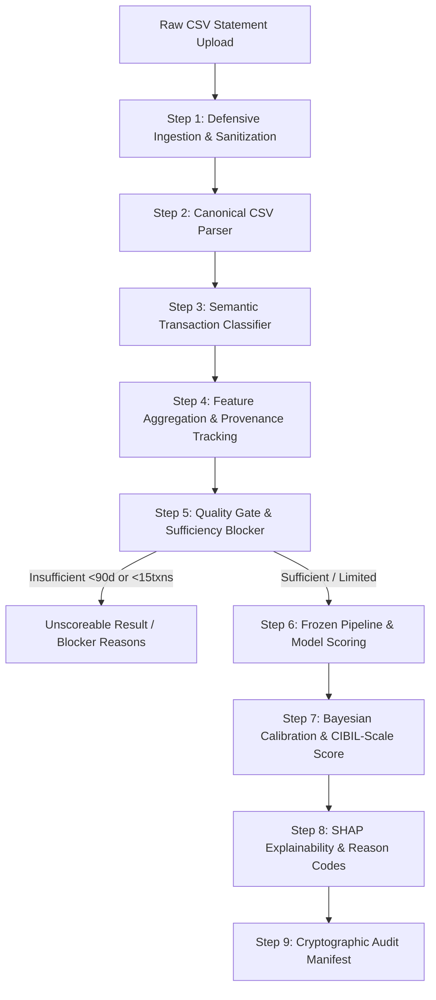
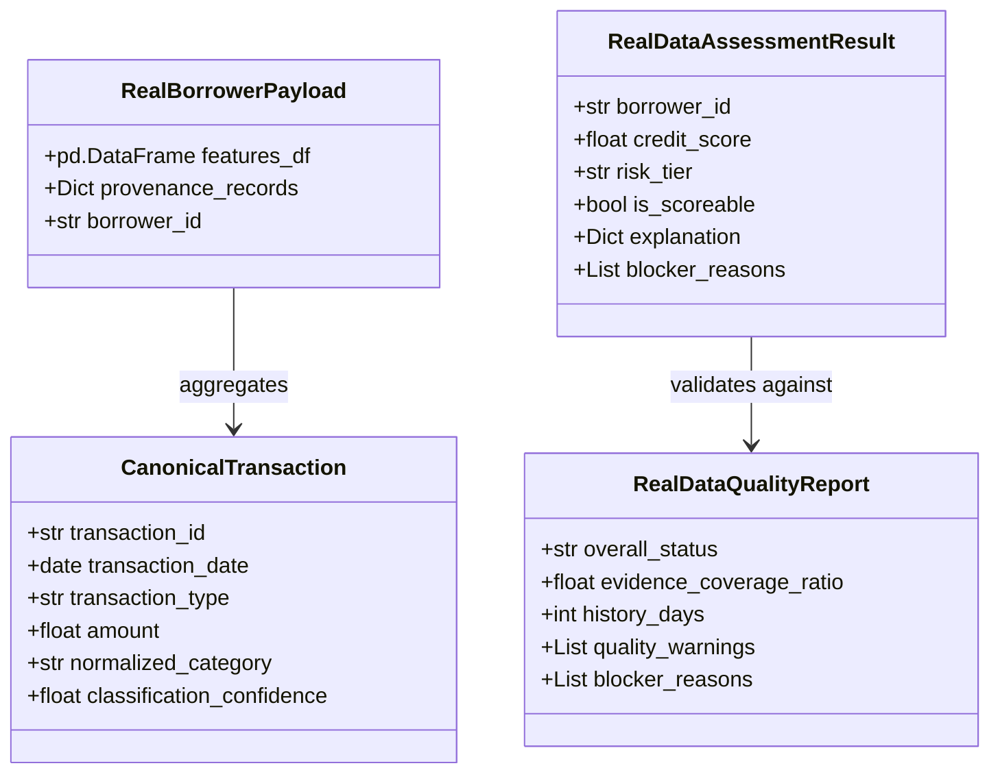

# Real Data Mode: Backend Architecture & Ingestion Journey

## 1. Overview & Architectural Philosophy

Real Data Mode provides an end-to-end, privacy-preserving alternative credit evaluation engine designed for thin-file and gig-economy borrowers in India. 

Rather than retraining or modifying the frozen predictive baseline (`models/credit_model.pkl`), Real Data Mode bridges unstandardized, real-world bank statements into the frozen model contract through deterministic parsing, semantic transaction classification, evidence sufficiency gating, and Bayesian odds calibration.

---

## 2. The 8-Stage Backend Execution Lifecycle

### Stage 1: Defensive Ingestion & Sanitization
- **Module**: `src/real_data_validation.py`
- **Responsibilities**:
  - Validates payload size strictly under **10 MB** (prevents memory exhaustion DOS).
  - Enforces a **50,000-row processing ceiling** to protect pipeline compute limits.
  - Verifies MIME types and checks against binary magic bytes (rejects ELF, PE, PDF, ZIP disguised as CSV).
  - Sanitizes file paths and filenames against directory traversal attacks (`../`, `..\\`).
  - Decodes strictly using standard UTF-8/ASCII encodings with BOM stripping.

### Stage 2: Canonical Multi-Bank CSV Parsing
- **Module**: `src/real_data_parser.py`
- **Responsibilities**:
  - Implements multi-tier bank statement header detection (supports HDFC, SBI, ICICI, Axis, and generic fintech layouts).
  - Normalizes date strings across ambiguous formats (`DD/MM/YYYY`, `YYYY-MM-DD`, `DD-Mon-YYYY`) using deterministic disambiguation.
  - Resolves amount representations: separate Debit/Credit columns, signed single-column amounts, or CR/DR indicator tokens.
  - Cleans Indian numeric formatting (handles comma separators: `1,00,000.50`).
  - Emits immutable `CanonicalTransaction` instances mapping to `CANONICAL_COLUMNS`.

### Stage 3: Semantic Transaction Classification
- **Module**: `src/transaction_classifier.py`
- **Responsibilities**:
  - Classifies raw transaction narrations into controlled enum categories (`NormalizedCategory`):
    - `SALARY_LIKE`: Employer payroll tokens (`NEFT`, `ACH`, `SALARY`, `PAYROLL`).
    - `GIG_INCOME_LIKE`: Gig platform aggregators (`ZOMATO`, `SWIGGY`, `ZEPTO`, `BLINKIT`, `UBER`, `OLA`).
    - `BUSINESS_INFLOW`: Merchant collection handles and QR inward settlements.
    - `TELECOM_RECHARGE`: Prepaid mobile recharges (`JIO`, `AIRTEL`, `VI`, `PAYTM RECHARGE`).
    - `UTILITY`: Electricity boards, water, and gas payments (`BESCOM`, `TATA POWER`, `MSEDCL`).
    - `INTERNAL_TRANSFER`: Self-transfers across accounts of the same individual.
    - `REFUND` / `REVERSAL`: Bounced or failed chargebacks.
  - Computes a classification confidence metric ($0.0 - 1.0$) per transaction.

### Stage 4: Feature Aggregation & Provenance Tracking
- **Modules**: `src/real_data_features.py`, `src/feature_provenance.py`
- **Responsibilities**:
  - Computes the 9 statement-derived features from classified transactions:
    - Monthly income estimation (annualized salary/gig tags or total valid inflows).
    - Monthly UPI transaction frequency and volume averages.
    - Inflow volatility coefficient ($\sigma_{\text{in}} / \mu_{\text{in}}$).
    - P2P vs. Merchant ratio ($V_{\text{P2P}} / \max(V_{\text{P2M}}, 1.0)$).
    - Recharge ticket size, frequency, and coefficient of variation.
  - Merges 3 self-reported inputs (`age`, `occupation_type`, `city_tier`) validated via `ManualInputContract`.
  - Sets the 9 unavailable features to `np.nan` (delegated to downstream median imputer).
  - Creates a tamper-evident `FeatureProvenanceRecord` for every feature.

### Stage 5: Data Quality & Evidence Sufficiency Gating
- **Module**: `src/real_data_quality.py`
- **Responsibilities**:
  - **Sufficiency Blocker Rule**:
    - Statements with **fewer than 90 calendar days** of transaction history OR **fewer than 15 valid transactions** are hard-blocked (`SufficiencyTier.INSUFFICIENT`).
    - Blocker triggers `is_scoreable = False`, halting execution before model scoring to prevent hallucinated risk assessments.
  - **Evidence Coverage Ratio**:
    - Calculates the proportion of model signals backed by observed transaction evidence vs. imputed medians.
  - **Distribution Shift Diagnostics**:
    - Checks derived values against 5th–95th training percentiles from `data/reference_distributions.json`. Flags outliers (`outside_observed_range`, `near_boundary`).

### Stage 6: Frozen Pipeline & Model Scoring
- **Module**: `src/real_data_scoring.py`
- **Responsibilities**:
  - Validates pre-inference schema (strictly 22 contract columns in identical order).
  - Passes features through the frozen `FeaturePipeline` (median imputation + standard scaling + one-hot encoding).
  - Computes raw default probability $p_{\text{raw}}$ via frozen LogisticRegression estimator.

### Stage 7: Bayesian Odds Calibration & CIBIL-Scale Score
- **Module**: `src/scoring_utils.py`
- **Responsibilities**:
  - Applies Bayesian prior calibration to shift the balanced training baseline ($50\%$ prior) to the realistic thin-file market prior ($\pi = 0.14$):
    $$\text{odds}_{\text{raw}} = \frac{p_{\text{raw}}}{1 - p_{\text{raw}}}, \quad \text{odds}_{\text{cal}} = \text{odds}_{\text{raw}} \times \frac{0.14}{0.86}, \quad p_{\text{cal}} = \frac{\text{odds}_{\text{cal}}}{1 + \text{odds}_{\text{cal}}}$$
  - Transforms calibrated log-odds to standard credit score scale $[300, 900]$:
    $$\text{Score} = \text{clip}\left(490.0 + 95.0 \times \ln\left(\frac{1 - p_{\text{cal}}}{p_{\text{cal}}}\right), 300, 900\right)$$
  - Maps to risk tiers: Low Risk ($\ge 750$), Moderate Risk ($650-749$), High Risk ($550-649$), Very High Risk ($< 550$).

### Stage 8: Local SHAP Explainability & Human Narratives
- **Module**: `src/explain.py`
- **Responsibilities**:
  - Computes exact local linear SHAP attributions using model coefficients and training expectation:
    $$\phi_j = w_j \cdot (x_j - E[X_j])$$
  - Selects Top-3 positive score drivers and Top-3 risk penalties.
  - Generates plain-English adverse action explanations adhering to Fair Credit Reporting Act (FCRA) and RBI fair-lending standards.

### Stage 9: Cryptographic Audit Manifest
- **Module**: `src/real_data_contracts.py`
- **Responsibilities**:
  - Computes SHA-256 hash of raw statement bytes.
  - Compiles execution timestamp, feature provenance records, data quality warnings, and output scores into an immutable `AuditManifest`.

---

## 3. Data Contracts & Schema Hierarchy

---

## 4. Error Handling Taxonomy

CreditBridge defines an explicit, hierarchy-based exception taxonomy in `src/real_data_contracts.py` that prevents unhandled crashes and ensures sanitized, leak-free error responses:

| Exception Class | HTTP / Code Mapping | Trigger Condition |
| :--- | :--- | :--- |
| `FileValidationError` | 400 Bad Request | Payload > 10 MB, invalid magic bytes, non-CSV format |
| `EmptyStatementError` | 422 Unprocessable | Statement contains 0 rows or only blank header lines |
| `DateParsingError` | 422 Unprocessable | Inconsistent, corrupted, or unresolvable transaction dates |
| `AmountParsingError` | 422 Unprocessable | Corrupted currency characters or unparseable amount entries |
| `InsufficientHistoryError` | 400 Bad Request | Statement spans < 90 calendar days or < 15 transactions |
| `MissingRequiredModelFeatureError` | 500 Internal | Feature extraction omitted one of the 22 required columns |
| `ModelSchemaMismatchError` | 500 Internal | Column ordering or column naming diverges from model contract |
| `UnknownCategoryError` | 422 Unprocessable | Self-reported occupation or city tier not in trained vocabulary |
| `ScoringPipelineError` | 500 Internal | Mathematical error during log-odds or score transformation |
